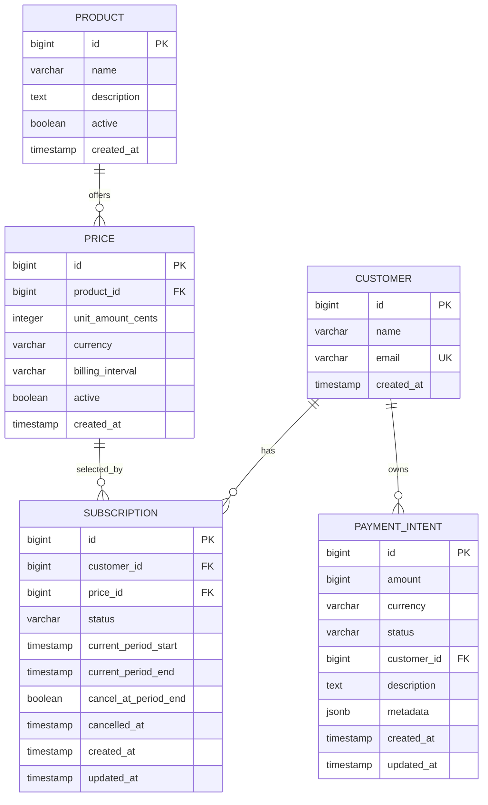

# Billing Platform API

A Stripe-inspired billing backend built with Spring Boot and PostgreSQL. It
exposes REST endpoints for customers, products, prices, subscriptions, and
payment intents, with Flyway-managed schema migrations and validation through
Spring Data JPA.

## Features

- Create, list, retrieve, and delete customers
- Keep customer email addresses normalised and unique
- Create and retrieve billing products
- List and retrieve seeded monthly, yearly, and one-time prices
- Create subscriptions from recurring prices only
- Prevent a customer from having more than one non-cancelled subscription
- Cancel existing subscriptions
- Create, retrieve, list, confirm, and cancel payment intents
- Store payment intent metadata as PostgreSQL `jsonb`
- Block customer deletion when payment intents already reference that customer
- Validate and version the database schema with Flyway
- Provide API connectivity and actuator health endpoints
- Support browser clients through configured CORS origins

## Technology

- Java 21
- Spring Boot 3.5.11
- Spring Web
- Spring Data JPA
- Spring Data Redis dependency
- Spring Boot Actuator
- Jakarta Bean Validation
- PostgreSQL
- Flyway
- Maven Wrapper
- Docker

## Project Structure

```text
src/main/java/com/nikitsya/billing/
|-- common/             # Shared API response types
|-- config/             # Web and CORS configuration
|-- customer/           # Customer API, model, and repository
|-- payment_intent/     # Payment intent API, model, and repository
|-- ping/               # Connectivity endpoint
|-- price/              # Price API, model, and repository
|-- product/            # Product API, model, and repository
`-- subscription/       # Subscription API, model, and repository

src/main/resources/
|-- application.properties
`-- db/migration/       # Flyway database migrations
```

## Prerequisites

- JDK 21 or later
- Docker, or a locally available PostgreSQL instance

Maven does not need to be installed because the repository includes the Maven
Wrapper.

## Configuration

The application reads its runtime configuration from environment variables:

| Variable | Required | Default | Description |
| --- | --- | --- | --- |
| `DB_URL` | Yes | None | PostgreSQL JDBC connection URL |
| `DB_USERNAME` | Yes | None | PostgreSQL username |
| `DB_PASSWORD` | Yes | None | PostgreSQL password |
| `PORT` | No | `8080` | HTTP server port |

Example:

```bash
export DB_URL='jdbc:postgresql://localhost:5432/billing'
export DB_USERNAME='billing'
export DB_PASSWORD='billing'
export PORT='8080'
```

Do not commit production credentials to the repository.

## Running Locally

### 1. Start PostgreSQL

```bash
docker run --name billing-postgres \
  -e POSTGRES_DB=billing \
  -e POSTGRES_USER=billing \
  -e POSTGRES_PASSWORD=billing \
  -p 5432:5432 \
  -d postgres:17
```

If the container already exists, start it instead:

```bash
docker start billing-postgres
```

### 2. Configure the application

```bash
export DB_URL='jdbc:postgresql://localhost:5432/billing'
export DB_USERNAME='billing'
export DB_PASSWORD='billing'
```

### 3. Start the API

```bash
./mvnw spring-boot:run
```

The API is available at `http://localhost:8080`.

Check that it is running:

```bash
curl http://localhost:8080/api/v1/ping
```

Expected response:

```text
ok
```

> **Development seed note:** `V6__insert_sample_subscriptions.sql` references
> customers by email. A completely empty database needs matching customer seed
> rows before that migration can insert the sample subscriptions.

## Running with Docker

Build the image:

```bash
docker build -t billing-platform-api .
```

Run it against the PostgreSQL container:

```bash
docker run --rm \
  --name billing-platform-api \
  --link billing-postgres:postgres \
  -p 10000:10000 \
  -e PORT=10000 \
  -e DB_URL='jdbc:postgresql://postgres:5432/billing' \
  -e DB_USERNAME='billing' \
  -e DB_PASSWORD='billing' \
  billing-platform-api
```

The containerised API is then available at `http://localhost:10000`.

## API Reference

All business endpoints use the `/api/v1` prefix.

| Method | Endpoint | Description | Successful status |
| --- | --- | --- | --- |
| `GET` | `/api/v1/ping` | Check API connectivity | `200 OK` |
| `POST` | `/api/v1/customers` | Create a customer | `201 Created` |
| `GET` | `/api/v1/customers` | List all customers | `200 OK` |
| `GET` | `/api/v1/customers/{id}` | Retrieve a customer | `200 OK` |
| `DELETE` | `/api/v1/customers/{id}` | Delete a customer | `204 No Content` |
| `POST` | `/api/v1/products` | Create a product | `201 Created` |
| `GET` | `/api/v1/products` | List all products | `200 OK` |
| `GET` | `/api/v1/products/{id}` | Retrieve a product | `200 OK` |
| `GET` | `/api/v1/prices` | List all prices | `200 OK` |
| `GET` | `/api/v1/prices/{id}` | Retrieve a price | `200 OK` |
| `POST` | `/api/v1/subscriptions` | Create a subscription | `201 Created` |
| `GET` | `/api/v1/subscriptions` | List all subscriptions | `200 OK` |
| `POST` | `/api/v1/subscriptions/{id}/cancel` | Cancel a subscription | `200 OK` |
| `POST` | `/api/v1/payment_intents` | Create a payment intent | `201 Created` |
| `GET` | `/api/v1/payment_intents` | List all payment intents | `200 OK` |
| `GET` | `/api/v1/payment_intents/{id}` | Retrieve a payment intent | `200 OK` |
| `POST` | `/api/v1/payment_intents/{id}/confirm` | Move a payment intent to processing | `200 OK` |
| `POST` | `/api/v1/payment_intents/{id}/cancel` | Cancel a payment intent | `200 OK` |
| `GET` | `/actuator/health` | Check application health | `200 OK` |

Error responses use a shared shape:

```json
{
  "code": "CUSTOMER_NOT_FOUND",
  "message": "Customer with id 1 was not found"
}
```

## Examples

### Create a Customer

```bash
curl -i -X POST http://localhost:8080/api/v1/customers \
  -H 'Content-Type: application/json' \
  -d '{
    "name": "Ada Lovelace",
    "email": "ada@example.com"
  }'
```

The name must not be blank and the email must be valid. Email addresses are
stored in lower case and must be unique. A duplicate email returns
`409 Conflict`.

Example response:

```json
{
  "id": 1,
  "name": "Ada Lovelace",
  "email": "ada@example.com",
  "createdAt": "2026-07-19T10:30:00"
}
```

### Create a Product

```bash
curl -i -X POST http://localhost:8080/api/v1/products \
  -H 'Content-Type: application/json' \
  -d '{
    "name": "Team Plan",
    "description": "Recurring plan for small teams"
  }'
```

New products are always marked as active by the API.

### List Prices

```bash
curl http://localhost:8080/api/v1/prices
```

Prices are stored in the smallest currency unit. For example,
`unitAmountCents: 999` with `currency: "EUR"` represents EUR 9.99.

Supported billing intervals are:

- `MONTHLY`
- `YEARLY`
- `ONE_TIME`

Price records are currently inserted by Flyway seed data rather than through a
price creation endpoint.

### Create a Subscription

```bash
curl -i -X POST http://localhost:8080/api/v1/subscriptions \
  -H 'Content-Type: application/json' \
  -d '{
    "customerId": 1,
    "priceId": 1
  }'
```

Only `MONTHLY` and `YEARLY` prices can be used for subscriptions. New
subscriptions start immediately with the `ACTIVE` status. Unknown customer or
price identifiers return `404 Not Found`; a one-time price returns
`400 Bad Request`; an existing non-cancelled subscription for the same customer
returns `409 Conflict`.

### Cancel a Subscription

```bash
curl -i -X POST http://localhost:8080/api/v1/subscriptions/1/cancel
```

Cancelling a subscription sets its status to `CANCELLED`. Cancelling an already
cancelled subscription returns `409 Conflict`.

### Create a Payment Intent

```bash
curl -i -X POST http://localhost:8080/api/v1/payment_intents \
  -H 'Content-Type: application/json' \
  -d '{
    "amount": 4999,
    "currency": "eur",
    "customerId": 1,
    "description": "One-time setup fee",
    "metadata": {
      "orderReference": "ORD-1001"
    }
  }'
```

Payment intent amounts are positive values in the smallest currency unit. The
currency is stored in lower case and must be three characters at the database
level. New payment intents start in `REQUIRES_CONFIRMATION`.

### Confirm a Payment Intent

```bash
curl -i -X POST http://localhost:8080/api/v1/payment_intents/1/confirm
```

Only payment intents in `REQUIRES_CONFIRMATION` can be confirmed. Confirmation
moves the status to `PROCESSING`; it does not contact a payment provider.

### Cancel a Payment Intent

```bash
curl -i -X POST http://localhost:8080/api/v1/payment_intents/1/cancel
```

Only payment intents in `REQUIRES_CONFIRMATION` can be cancelled. Other statuses
return `409 Conflict`.

## Data Model



Flyway applies migrations automatically when the application starts. Hibernate
uses `validate` mode, so the application checks entity mappings without
modifying the schema.

## Building and Testing

Run the test suite:

```bash
./mvnw test
```

Create the executable JAR:

```bash
./mvnw clean package
```

Run the packaged application:

```bash
java -jar target/billing-platform-0.0.1-SNAPSHOT.jar
```

## CORS

The API accepts browser requests from:

- `http://localhost:5173`
- `http://localhost:63342`
- `http://localhost:63343`
- `https://billing.nikitsya.dev`

Allowed methods are `GET`, `POST`, `DELETE`, and `OPTIONS`.

## Current Scope

This project currently covers catalogue management, recurring subscription
creation and cancellation, and a local payment intent lifecycle suitable for a
billing prototype. It does not yet authenticate API clients, create prices via
the API, issue invoices, process real payments through an external provider, or
move payment intents automatically from `PROCESSING` to a terminal status.
